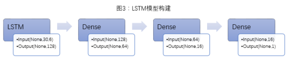

# [正则项](https://keras-cn.readthedocs.io/en/latest/other/regularizers/)

正则项在优化过程中层的参数或层的激活值添加惩罚项，这些惩罚项将与损失函数一起作为网络的最终优化目标

惩罚项基于层进行惩罚，目前惩罚项的接口与层有关，但`Dense`, `Conv1D`, `Conv2D`, `Conv3D`具有共同的接口。

### 使用例

    from keras import regularizers
    model.add(Dense(64, input_dim=64，
                    kernel_regularizer=regularizers.l2(0.01),
                    activity_regularizer=regularizers.l1(0.01)))

### 开发新的正则项

任何以权重矩阵作为输入并返回单个数值的函数均可以作为正则项，例如：

    from keras import backend as K

    def l1_reg(weight_matrix):
        return 0.01 * K.sum(K.abs(weight_matrix))

    model.add(Dense(64, input_dim=64,
                    kernel_regularizer=l1_reg)

# [LSTM层](https://keras-cn.readthedocs.io/en/latest/layers/recurrent_layer/)

    keras.layers.recurrent.LSTM(units, activation='tanh', recurrent_activation='hard_sigmoid', use_bias=True, kernel_initializer='glorot_uniform', recurrent_initializer='orthogonal', bias_initializer='zeros', unit_forget_bias=True, kernel_regularizer=None, recurrent_regularizer=None, bias_regularizer=None, activity_regularizer=None, kernel_constraint=None, recurrent_constraint=None, bias_constraint=None, dropout=0.0, recurrent_dropout=0.0)

### 参数

- `kernel_regularizer`: 施加在权重上的正则项
- `bias_regularizer`：施加在偏置向量上的正则项
- `recurrent_regularizer`：施加在循环核上的正则项
- `activity_regularizer`：施加在输出上的正则项

# [How to Use Weight Regularization with LSTM Networks for Time Series Forcasting](http://machinelearningmastery.com/use-weight-regularization-lstm-networks-time-series-forecasting/)

# [LSTM Networks应用于股市市场探究](https://zhuanlan.zhihu.com/p/27112144?utm_source=wechat_session&utm_medium=social)

## LSTM Networks处理股票时间序列的流程

- 数据获取与处理: 对于时间序列，我们通常会以`[X(t-n),X(t-n+1),…,X(t-1),X(t)]`这`n`个时刻的数据作为输入来预测`(t+1)`时刻的输出。对于股票来说，在t时刻会有若干个`features`，因此，为了丰富`features`以使模型更加精确，本文将`n(time series)×s(features per time series)`的二维向量作为输入。`LSTM`对于数据标准化的要求很高，因此本文所有`input`数据均经过`z-score`标准化处理。

- `LSTM`模型构建: 作为循环层的一种神经网络结构，只使用`LSTM`并不能构建出一个完整的模型，`LSTM`还需要与其他神经网络层（如`Dense`层、卷积层等）配合使用。此外，还可以构建多层`LSTM`层来增加模型的复杂性。

## LSTM对沪深300未来五日收益率预测

数据选择和处理：

- `input`的时间跨度为30天，每天的`features`为`['close','open','high','low','amount','volume']`共6个，因此每个`input`为30×6的二维向量。

- `output`为未来5日收益`future_return_5` `(future_return_5>0.2,取0.2;future_return_5<-0.2,取-0.2)`，为使训练效果更加明显，`output=future_return_5×10`; `features`均经过标准化处理(在每个样本内每个`feature`标准化处理一次)。

- 训练数据：沪深300 `2005-01-01`至`2014-12-31`时间段的数据；测试数据：沪深300 `2015-01-01`至`2017-05-01`时间段数据。

- 模型构建：鉴于数据较少（训练数据约2500个，预测数据约500个），因此模型构建的相对简单。模型共四层，为一层`LSTM`层+三层`Dense`层（图3）。

每个模型做两次回测，第一次回测（后文简称回测1）为直接以LSTM预测值在沪深300上做单：若LSTM预测值为1，买入并持有5day（若之前已持仓，则更新持有天数），若LSTM预测值为-1，若为空仓期，则继续空仓，若已持有股票，则不更新持有天数；

第二次回测（后文简称回测2）为以LSTM为择时指标，与`StockRanker`结合在3000只股票做单：若LSTM预测值为1，则允许`StockRanker`根据其排序分数买入股票，若LSTM预测值为-1，若为空仓期，则继续空仓，若已持有股票，则禁止`StockRanker`买入股票，根据现有股票的买入时间，5天内清仓；

