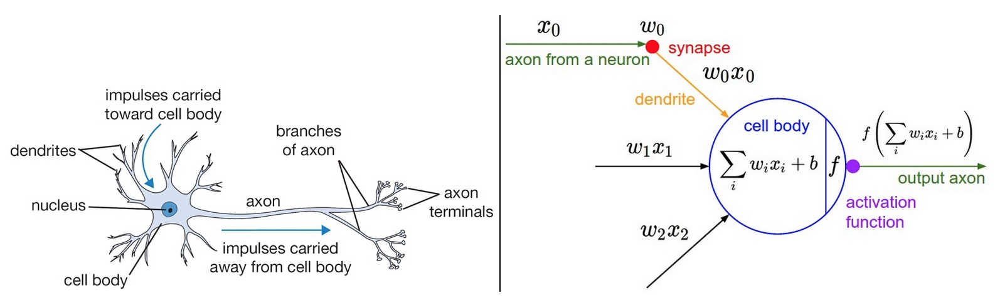
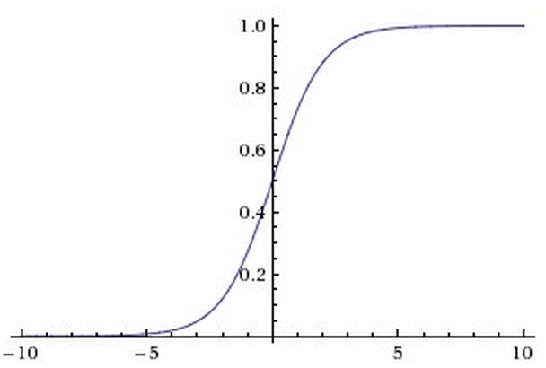
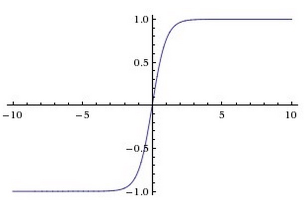
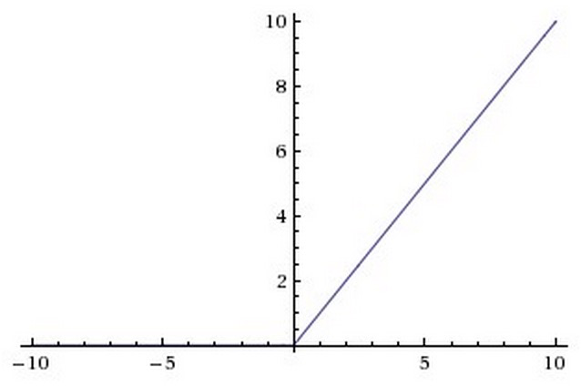
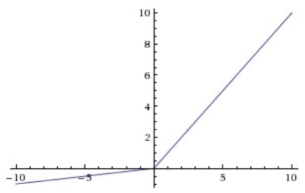
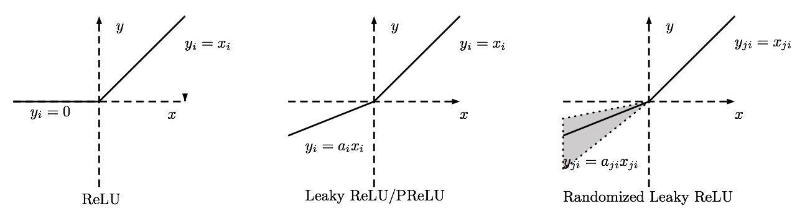
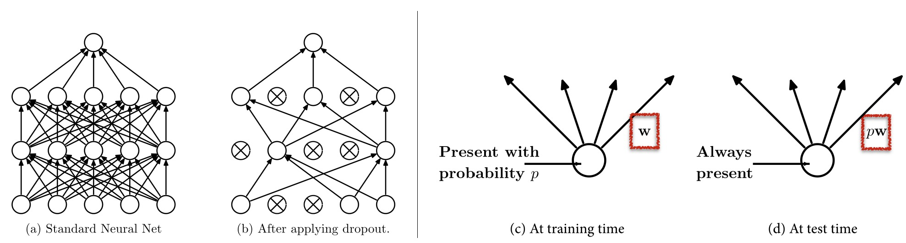
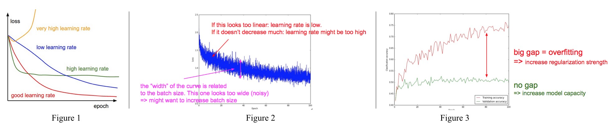

# [Must Know Tips/Tricks in Deep Neural Networks](http://lamda.nju.edu.cn/weixs/project/CNNTricks/CNNTricks.html)

## Data Augmentation

Data augmentation can boost performance and also becomes the thing must to do when training a deep network.

> There are many ways to do data augmentation, such as horizontally flipping, random crops and color jittering.[^1]

## Pre-Processing

The first and simple pre-processing approach is zero-center the data, and then normalize them, which is presented as two lines Python codes as follows:

	X -= np.mean(X, axis = 0) # zero-center
	X /= np.std(X, axis = 0) # normalize

Where, X is the input data. Another form of this pre-processing normalizes each dimension so that the min and max along the dimension is -1 and 1. It only makes sense to apply this pre-processing if you have a reason to believe that different input features have different scales (or units), but they should be of approximately equal importance to the learning algorithm.

Another pre-processing approach similar to the first one is PCA Whitening. In this process, the data is first centered as described above. Then, you can compute the covariance matrix that tells us about the correlation structure in the data:

	X -= np.mean(X, axis = 0) # zero-center
	cov = np.dot(X.T, X) / X.shape[0] # compute the covariance matrix

After that, you decor relate the data by projecting the original (but zero-centered) data into the eigenbasis[^2]:

	U,S,V = np.linalg.svd(cov) # compute the SVD factorization of the data covariance matrix
	Xrot = np.dot(X, U) # decorrelate the data

The last transformation if whitening, which take the data in the eigenbasis and divides every dimension by eigenvalue to normalize the scale:

	Xwhite = Xrot / np.sqrt(S + 1e-5) # divide by the eigenvalues (which are square roots of the singular values)

> Please note that, we describe these pre-processing here just for completeness. In practice, these transformations are not used with Convolutional Neural Networks.

## Initializations

### Initialization with Small Random Numbers

The idea is that the neurons are all random and unique in the beginning, so they will compute distinct updates and integrate themselves as diverse parts of the full network.

### Calibrating the Variances

You can normalize the variance of each neuron’s output to 1 by scaling its weight vector by the square root of its fan-in, which is as follows:

	w = np.random.randn(n) / sqrt(n) # calibrating the variances with 1/sqrt(n)

This ensures that all neurons in the network initially have approximately the same output distribution and empirically improves the rate of convergence.

## During Training

### Filters and pooling size

### Learning rate

You should not always change the learning rates , if you change the min batch size. For obtaining an appropriate LR, utilizing the validation set is an effective way.Usually, a typical value of LR in the beginning of your training is 0.1. In practice, if you see that you stopped making progress on the validation set, divide the LR by 2 (or by 5), and keep going.

### Fine-tune on pre-trained models.

Nowadays, many state-of-the-arts deep networks are released by famous research groups. Thanks to the wonderful generalization abilities of pre-trained deep models, you could employ these pre-trained models for your own applications directly. For further improving the classification performance on your data set, a very simple yet effective approach is to fine-tune the pre-trained models on your own data.

## Activation Functions



### Sigmoid

### tanh(x)

### Rectified Linear Unit

### Leaky ReLU

### Parametric ReLU

## Regularizations

### L2 regularization

Perhaps the most common form of regularization. It can be implemented by penalizing the squared magnitude of all parameters directly in the objective.

The L2 regularization has the intuitive interpretation of heavily penalizing peaky weight vectors and preferring diffuse weight vectors.

### L1 regularization

Another relatively common form of regularization, where for each weight w we add the term lambda |w| to the objective. It is possible to combine the L1 regularization with the L2 regularization: `lambda_1 |w|+lambda_2 w^2.`

In practice, if you are not concerned with explicit feature selection, L2 regularization can be expected to give superior performance over L1.

### Max norm constraints

Enforce an absolute upper bound on the magnitude of the weight vector for every neuron and use projected gradient descent to enforce the constraint.

### Dropout

During training, dropout can be interpreted as sampling a Neural Network within the full Neural Network, and only updating the parameters of the sampled network based on the input data.

## Insights from Figures

During training time, you can draw some figures to indicate your networks’ training effectiveness.

- A very high learning rate will cause a quite strange loss curve. A low learning rate will make your training loss decrease very slowly. In contrast, a high learning rate will make training loss decrease fast at the beginning, but it will also drop into a local minimum. For a good learning rate, as the red line shown in Figure 1, its loss curve performs smoothly and finally it achieves the best performance.
- If we draw the classification loss every training batch, the curve performs like Figure 2. Similar to Figure 1, if the trend of the loss curve looks too linear, that indicated your learning rate is low; if it does not decrease much, it tells you that the learning rate might be too high. Moreover, the “width” of the curve is related to the batch size. If the “width” looks too wide, that is to say the variance between every batch is too large, which points out you should increase the batch size.
- Shown in Figure 3, the red line is the training accuracy, and the green line is the validation one. When the validation accuracy converges, the gap between the red line and the green one will show the effectiveness of your deep networks. If the gap is big, it indicates your network could get good accuracy on the training data, while it only achieve a low accuracy on the validation set. Thus, you should increase the regularization strength of deep networks. However, no gap meanwhile at a low accuracy level is not a good thing, which shows your deep model has low learnability. In this case, it is better to increase the model capacity for better results.

## Ensemble

Ensemble methods: train multiple learners and then combine them for use. Here we introduce several skills for ensemble in the deep learning scenario.

### Same model, different initialization

Use cross-validation to determine the best hyper-parameters, then train multiple models with the best set of hyper-parameters but with different random initialization. 

### Top models discovered during cross-validation

Use cross-validation to determine the best hyper-parameters, then pick the top few models to form the ensemble. This improves the variety of the ensemble but has the danger of including suboptimal models.

### Different checkpoints of a single model

If training is very expensive, some people have had limited success in taking different checkpoints of a single network over time and using those to form an ensemble.

[^1]:	All these methods seems to related with image processing though.

[^2]:	In linear algebra, an eigenvector or characteristic vector of a linear transformation is a non-zero vector whose direction does not change when that linear transformation is applied to it.