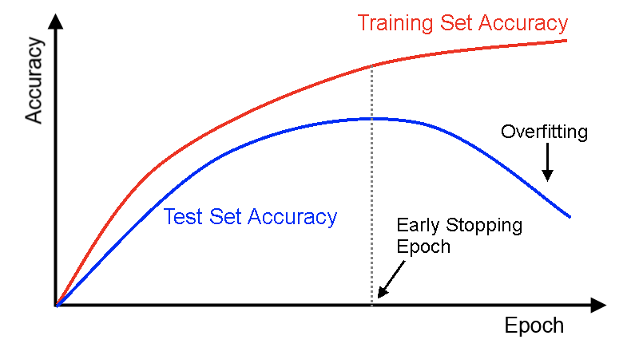

# [早终止](https://en.wikipedia.org/wiki/Early_stopping)

在机器学习中，早终止是一种用来避免使用迭代方法训练导致过度拟合的规定，比如梯度下降。用这样的方法可以使模型在每次迭代中更好地符合训练数据。在一定程度上，这提高了模型在训练集之外的表现。不使用早终止时，提高模型与训练数据集的配合程度是以增加泛化误差为代价的。

## 基于分析结果的早终止

### 统计学习理论中的早终止

早终止可以用于规范机器学习的非参数回归中遇到的问题。

### 提升方法中的早终止

提升方法是一种可以用来减小监督是学习中偏差的机器学习方法，将一组较弱的模型组合为一个较强的模型。早终止可以提供一致性的保证。

## 基于验证的早终止

这些早终止方法通过将原训练集拆分成一个新的训练集和验证集。验证集的误差用于判断过拟合何时开始。

更复杂的形式使用交叉验证——将数据分成多个训练集和验证集，而不是单一的训练集和验证集。

# [使用早终止的训练网络](https://deeplearning4j.org/earlystopping)

训练神经网络时，需要给定许多相关的参数来获得良好的性能。如果给定过少的训练次数，可能欠拟合（没有从训练集中学到所有有用信息）；如果给定过多的训练次数，可能过度拟合（符合了训练集中的噪音，而不是信号）。

早终止试图消除手动设定这个值的需要，它也可以被认为是一种可以阻止神经网络过拟合的正则化方法。

早终止背后的想法是比较简单的：

- 拆分数据为训练和测试集
- 在每个（或每N个）训练轮的最后：
	- 在测试集上评估网络性能
	- 如果当前的网络性能优于之前的一个：将当前的网络副本保存。
- 将具有最佳性能的模型作为最终模型

如下图所示：

最好的模型是那个具有最佳测试集精度的。

# [回调函数Callbacks](https://keras-cn.readthedocs.io/en/latest/other/callbacks/)

回调函数是一组在训练的特定阶段被调用的函数集，你可以使用回调函数来观察训练过程中网络内部的状态和统计信息。通过传递回调函数列表到模型的`.fit()`中，即可在给定的训练阶段调用该函数集中的函数。

> Keras的回调函数实际上是一个类。

## Callback

	keras.callbacks.Callback()

这是回调函数的抽象类，定义新的回调函数必须继承自该类

### 类属性

- `params`: 字典，训练参数集（比如verbosity, batch, epoch）
- `model`: `keras.model.Model`对象，为正在训练的模型的引用

回调函数以字典`logs`为参数，该字典包含了一系列与当前batch或epoch相关的信息。

目前，模型的`.fit()`中有下列参数会被记录到`logs`中：

- 在每个epoch的结尾处（on_epoch_end），`logs`将包含训练的正确率和误差，`acc`和`loss`，如果指定了验证集，还会包含验证集正确率和误差`val_acc`和`val_loss`，`val_acc`还额外需要在`.compile`中启用`metrics=[‘accuracy’]`。  

- 在每个batch的开始处（on_batch_begin）：`logs`包含`size`，即当前batch的样本数  

- 在每个batch的结尾处（on_batch_end）：`logs`包含`loss`，若启用`accuracy`则还包含`acc`

### 使用例

	class EarlyStoppingByLossVal(Callback):
	    def __init__(self, monitor='val_loss', value=0.00001, verbose=0):
	        super(Callback, self).__init__()
	        self.monitor = monitor
	        self.value = value
	        self.verbose = verbose
	
	    def on_epoch_end(self, epoch, logs={}):
	        current = logs.get(self.monitor)
	        if current is None:
	            warnings.warn("Early stopping requires %s available!" % self.monitor, RuntimeWarning)
	
	        if current < self.value:
	            if self.verbose > 0:
	                print("Epoch %05d: early stopping THR" % epoch)
	            self.model.stop_training = True
	
	callbacks = [
	    EarlyStoppingByLossVal(monitor='val_loss', value=0.00001, verbose=1),
	    # EarlyStopping(monitor='val_loss', patience=2, verbose=0),
	    ModelCheckpoint(kfold_weights_path, monitor='val_loss', save_best_only=True, verbose=0),
	]
	model.fit(X_train.astype('float32'), Y_train, batch_size=batch_size, nb_epoch=nb_epoch,
	      shuffle=True, verbose=1, validation_data=(X_valid, Y_valid),
	      callbacks=callbacks)

## EarlyStopping

	keras.callbacks.EarlyStopping(monitor='val_loss', patience=0, verbose=0, mode='auto')

当监测值不再改善时，该回调函数将中止训练

### 参数

- `monitor`: 需要监视的量
- `patience`: 当early stop被激活（比如发现loss相比上一个epoch训练没有下降），则经过`patience`个epoch后停止训练
- `verbose`: 信息展示模式
- `mode`: ‘auto’, ‘min’, ‘max’之一，在`min`模式下，如果检测值停止下降则中止训练。在`max`模式下，当检测值不再上升则中止训练。

### 使用例

	callbacks = [
	    EarlyStopping(monitor='val_loss', patience=2, verbose=0),
	    ModelCheckpoint(kfold_weights_path, monitor='val_loss', save_best_only=True, verbose=0),
	]
	model.fit(X_train.astype('float32'), Y_train, batch_size=batch_size, nb_epoch=nb_epoch,
	      shuffle=True, verbose=1, validation_data=(X_valid, Y_valid),
	      callbacks=callbacks)    
